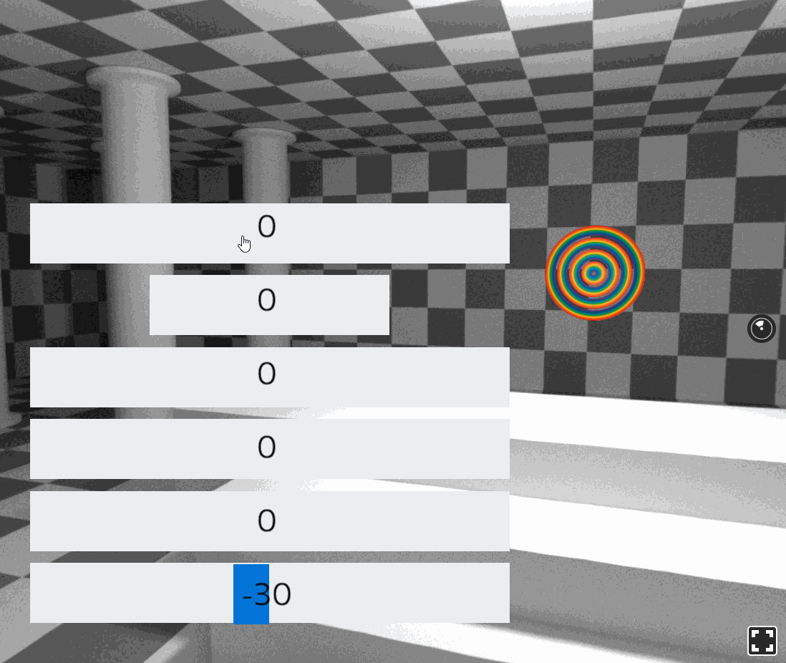

# react-vr-slider

Slider extension for ReactVR.



# Usage

1. Install

```bash
npm i --save react-vr-slider
```
2. Import to your file add pass it `onChange` (function).

```js
import React from 'react'
import { View } from 'react-vr'
import { Slider, RangeSlider } from 'react-vr-slider'

class Example extends React.Component {
    constructor() {
        super()
        constructor(props) {
            super(props);

            this.state = {
                translate: {
                    translateX: 0,
                }
            };
    }

  setTranslateX = (value) => {
    let translate = {...this.state.translate};
    translate.translateX = value/10;
    this.setState({translate});
  }; 

  render () {
    return (
        <View>
          <RangeSlider maxValue={200} value={0} step={1} onChange={this.setTranslateX} />
          <Slider maxValue={200} value={0} step={5} onChange={this.setTranslateX} />
        </View>
    )
  }
}  
```

# License

MIT. See [LICENSE](./LICENSE)